## Table of contents
---- 

- [Overview](#Milestone-Project-3 "Milestone Project 3")  
- [The Trusted Barista](#The-Trusted-Barista "The Trusted Barista")  
- [User Experience](#user-experience-(ux) "User Experience")  
   - [User Stories](#user-stories "User Stories")  
        - [First Time Visitor Goals](#first-time-visitor-goals "First Time Visitor Goals")  
        - [Returning Visitor Goals](#returning-visitor-goals "Returning Visitor Goals")  
        - [Frequent User Goals](#frequent-user-goals "Frequent User Goals")  
        - [Admin User Goals](#admin-user-goals "Admin User Goals")
- [Design](#design "Design")  
    - [Colour Scheme](#colour-scheme "Colour Scheme")  
    - [Typography](#typography "Typography")  
    - [Imagery](#imagery "Imagery")  
- [Skeleton](#skeleton "skeleton")
    - [Wireframes](#wireframes "Wireframes")
    - [Topology](#topology "Topology")
    - [Jinja Topology](#jinja-topology "Jinja Topology")
    - [Database Schema](#database-schema "Database Schema")  
        - [beans](#beans "beans")
        - [newsletters](#newsletters "newsletter")
        - [origins](#origins "origins")
        - [privacy_policy](#privacypolicy "Privacy policy")
        - [roast](#roast "roast")
        - [users](#users "users")
        - [Relationships between Databases](#relationships-between-databases "Relationship between Databases")
- [Features](#features "Features")  
- [Technologies Used](#technologies-used "Technologies Used")  
    - [Languages Used](#languages-used "Languages Used")  
        - [HTML5](#html5 "HTML5")  
        - [CSS3](#css3 "CSS3")  
        - [Javascript & JQuery](#javascript/query "Javascript & JQuery")  
        - [Python](#python "Python")
    - [Database](#database "Database")
        - [MongoDB](#mmongodb "MongoDB")
- [Frameworks, Libraries & Programs used](#frameworks-libraries-&-programs-used "Frameworks, Libraries & Programs used")  
    - [Bootstrap v.4.5.3](#bootstrap-v.4.5.3 "Bootstrap v.4.5.3") 
    - [Google Fonts](#google-fonts "Google Fonts")    
    - [Favicon](#favicon "Favicon")   
    - [Figma](#figma "Figma")  
    - [Coolors.co](#coolors.co "Coolors.co")  
    - [jQuery](#jquery "jQuery")  
    - [Git](#git "Git")  
    - [GitHub](#github "GitHub")  
    - [Gitpod](#gitpod "Gitpod") 
    - [Flask](#flask "Flask") 
    - [PyMongo](#pymongo "PyMongo")
    - [Werkzeug](#werkzeug "Werkzeug")
    - [Randomkeygen](#randomkeygen "Randomkeygen")
    - [EmailJS](#emailjs "EmailJS")
    - [Google Map Generator](#google-map-generator "Google Map Generator")
    - [Lighthouse](#lighthouse "Lighthouse")    
- [Testing](#testing "Testing")  
        - [Testing User Stories from User Experience (UX)](TESTING.md)
    - [Further Testing](#further-testing "Further Testing")  
    - [Known Bugs](#known-bugs "Known Bugs")  
- [Deployment](#deployment "Deployment")   
    - [Local Clone](#local-clone "Local Clone") 
    - [MongDB Setup](#2-mongodb-setup "MongoDB Setup")
    - [Environment Setup](#3-environment-setup "Environment Setup")
    - [Deployment to Heroku](#4-deployment-to-heroku "Deployment to Heroku")
    - [Development](#development "Development")  
    - [Bugs & Feature Requests](#bugs-&-feature-requests "Bugs & Feature Requests")  
- [Credits](#credits "Credits")  
    - [Code](#code "Code")  
    - [Content](#content "Content")  
    - [Media](#media "Media")  
    - [Acknowledgements](#acknowledgements "Acknowledgements")  
# Milestone Project 3 - The Trusted Barista
           
    

This was created to demonstrate learnings from the Code Institute software development course and marks the third of four milestone projects to be created. It utilises HTML, CSS,Javascript, Jquery, Pymongo, Jinja 2, MongoDB and UX by way of an interactive website that can store user data to the back end. 

## The Trusted Barista

The Trusted Barista is a website designed for coffee lovers. Inspired by the likes of trustpilot, TripAdvisor etc. It aims to provide an honest review site for finding the right coffee for it's users. It allows users to Create reviews, Read and search for reviews, Update said reviews and Delete reviews that they have created as well as providing a platform for conversation of reviews by way of comments.

For the site owner, it's purpose is to capture user email addresses so as to promote paid for content by way of advertising through newlestters and commissions by way of affiliate links. 

A live version of the site can be viewed [here](https://flask-ms3-coffee.herokuapp.com).

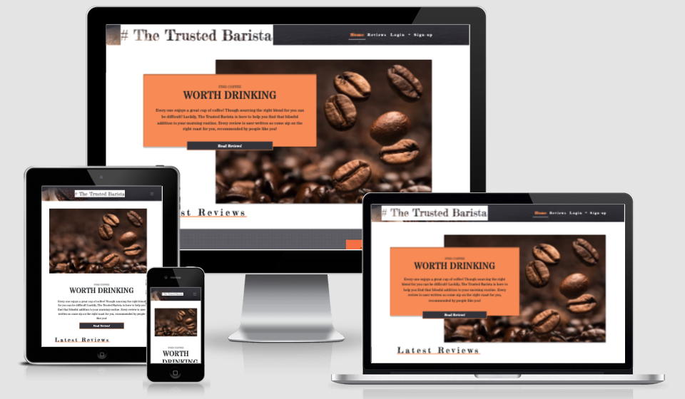

## User Experience (UX)
### User stories
#### First Time Visitor Goals
* As a First Time Visitor, I want to understand the purpose of the site. 
* As a First Time Visitor, I want to easily navigate through the site.
* As a First Time Visitor, I want to be redirected to the landing page if I navigate to a wrong or broken link.
* As a First Time Visitor, I want to find the site owners social media channels. 
#### Returning Visitor Goals
* As a Returning Visitor, I want to create an account so that I can write reviews and add or delete comments.
* As a Returning Visitor, I want to engage with other users.
* As a Returning Visitor, I want to engage and be engaged with by the site owners.
* As a Returning Visitor. I want to find where I can purchase coffee of reviews that I like.
#### Frequent User Goals
* As a Frequent User, I want to access the site across a range of devices.
* As a Frequent user, I want to manage my profile and reviews that I have left. 
* As a Frequent user, I want to update my preferences.
* As a Frequent user, I want to favourite reviews that I like so as to easily find in the future. 
* As a frequent user, I want to ensure that my data is being used accordingly.  

#### Admin User Goals
* As an Admin, I want to enable or disbale other accounts with Admin permission. 
* As an Admin, I want to moderate site content of reviews and comments.
* As an Admin, I want to remove users if necessary. 
* As an Admin, I want to see statistics on the number of users and reviews on the site. 

### Design
#### Colour Scheme
The site uses the following colours primarily.   
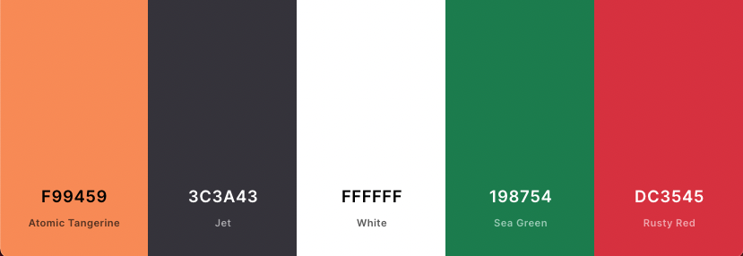
* Atomic Tangerine - rgb(249,148,89) #f99459
* Jet Grey - rgb(60,58,67) #3C3A43
* White - rgb(255,255,255) #ffffff

In addition, the site also utilises the following colours for some Bootstrap buttons:   
* btn-success - (Sea Green) - rgb(25,135,84) #198754
* btn-danger - (Rusty Red) -  rgb(220,53,69) #dc3545
* btn-secondary -(Slate Grey) - rgb(108,117,125) #6c757d

#### Typography
* [Fredericka the Great](https://fonts.google.com/specimen/Fredericka+the+Great) is used on all `<h>` elements and major headings such as the brand logo in the header and footer throughout the site with cursive as a fall back in case of errors in loading the font. Fredericka the Great is a stylish popular choice as a chalkboard esque font and so fits the target market of those that would frequent coffee shops that would typically have menu's on hip blackboard's. It gives a modern and trendy feel to the site. 
* [Stardos Stencil](https://fonts.google.com/specimen/Stardos+Stencil) is used on all other primary elements such as `
`,` ` etc. Stencil fonts are a popular choice amidst many within the hospitality indusrty as a menu font so it was a fitting choice that complimented the design ethos of the site in addition to complimenting Fredericka the Great font.  
#### Imagery
The site uses only 4 images natively. 5 if you were to consider the logo branding as an image (styled using CSS). 
* The image that covers the navbar.

* The hero image of coffee beans found on the index page.  

* A fallback image is used for users that do not have a link to an image when leaving reviews.

* A default user profile image is used for all users.  

All other additional images outside of this are user generated by way of an image link when adding a review.
### Skeleton
#### Wireframes
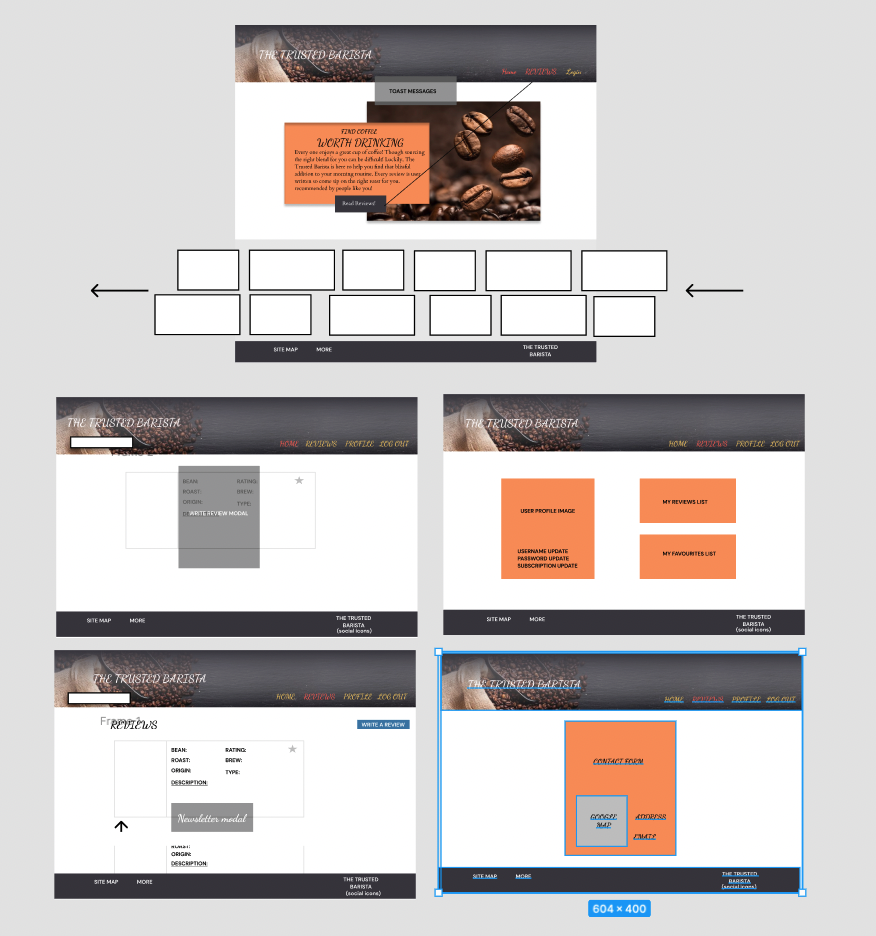    
#### Topology   
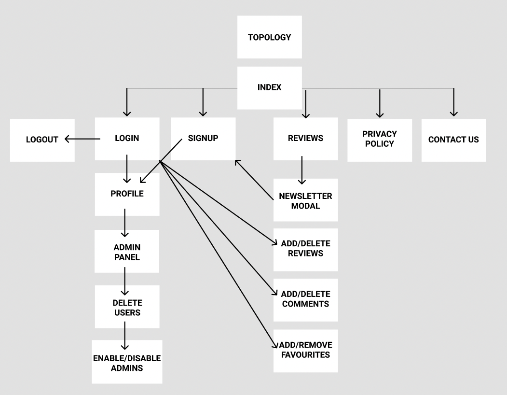 
#### Jinja Topology
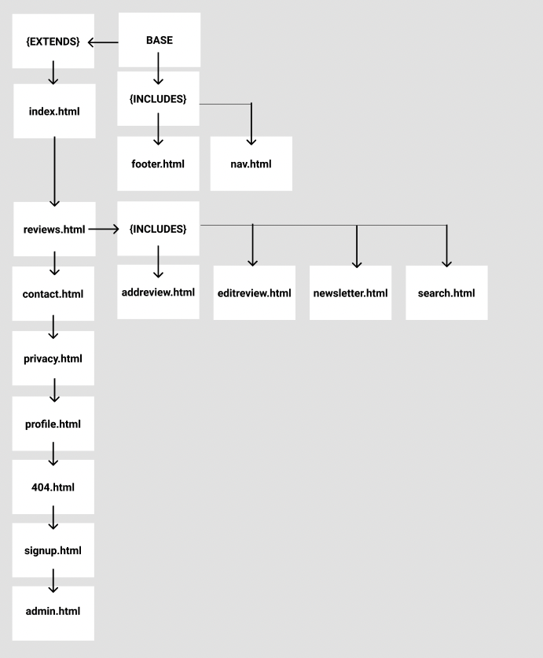 

Full Wireframes drawn up using Figma can be found [here](https://www.figma.com/file/5Q0MvWaoK8Ik7WpKtyCzTZ/MS3?node-id=0%3A1)

#### Database Schema
#### **beans**
| Name  | Type  |   |   |
|:-:|:-:|:-:|:-:|
| _id  | ObjectId  |
| bean_name  | String  |
| bean_roast  | String   |
| bean_rating  | String   |
| bean_description  | String   |
| bean_origin  | String   |
| origin_type  | String   |
| brew_type  | String   |
| bean_image  | String   |
| affialiate_link  | String   |
| created_by  | String   |
|created_by_id|ObjectId|
| created_date  |  Date |
|favshown|Boolean|
| favoured_by  | Array  |
|   | Object  | Object |
||user_id| ObjectId |
||user_name| String  |
|comments|Array|
||Object| Object |
||comment_id| ObjectId |
||user_id| ObjectId|
||username| String |
||comment| String |

#### **newsletters**
|Name   |Type   |
|:-:|:-:|
|_id | ObjectId |
|name | string |
|email | string |

#### **origin**
|Name   |Type   |
|:-:|:-:|
|_id | ObjectId |
|origin_type | string |

#### **privacy_policy**
|Name   |Type   |
|:-:|:-:|
|_id | ObjectId |
|title | string |
|description|string|

#### **roast**
|Name   |Type   |
|:-:|:-:|
|_id | ObjectId |
|bean_roast | string |

#### **users**
|Name   |Type   ||
|:-:|:-:|:--:|
|_id | ObjectId ||
|email | String ||
|username|String||
|password|String||
|tandc|String||
|is_admin|Boolean||
|newsletter_check|String||
|signup_date|Date||
|last_login|Date||
|favourites|Array||
||Object| Object|
||coffee_id| ObjectId|
||coffee_name|String|
||favshown|Boolean|

#### **Relationships between Databases**
|beans  DB |users DB  ||
|:-:|:-:|:--:|
|_id|coffee_id||
|bean_name|coffee_name||
|favshown|favshown||
|user_id|_id||
|username|username||

## Features
* The Home page features a carousel esque animation for displaying the 6 most recent reviews. The animation only displays on Desktop and is otherwise displayed as a gallery on mobile.  
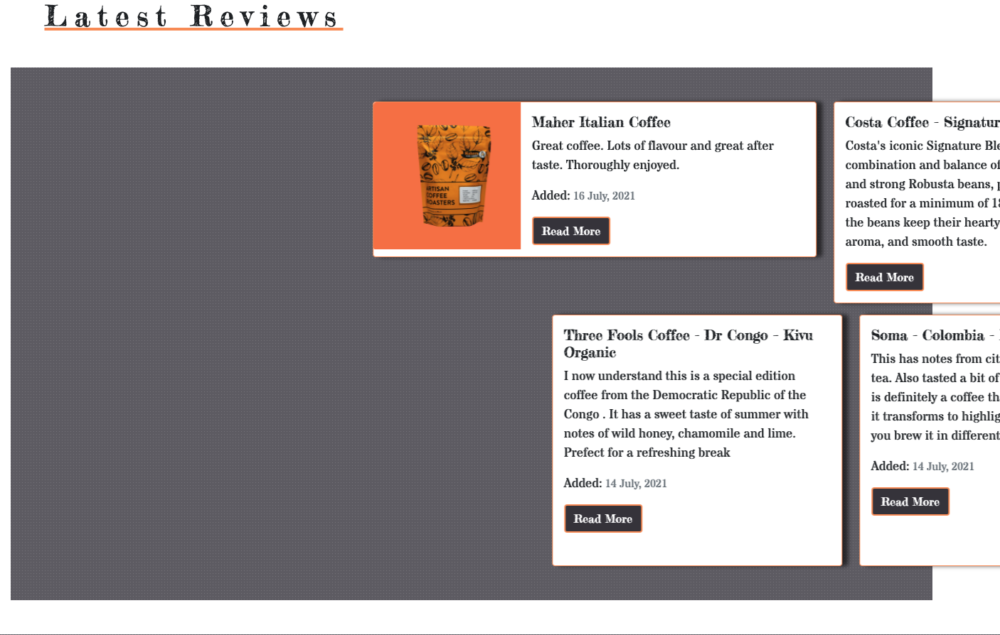  
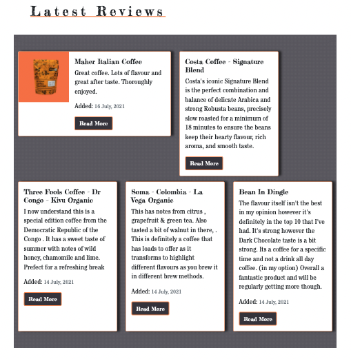
* The site uses Flask jinja templating to dynamically display reviews and other content.   

* The Site uses toasts to alert the user of succesffully completing actions throughout the site.  
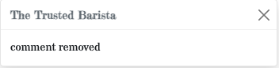
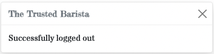
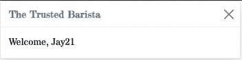
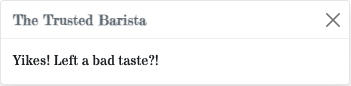
* The site uses defensive programming to prevent unauthorised access to parts of the site that are locked to having an account or an admin permission set. 
* The site uses various modals throughout so as to keep the user experience fluidic.  
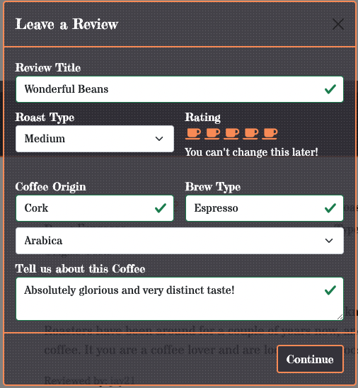
* When adding a new review, the user is given an option to edit their review before submission. This is achieved using Javascript.  
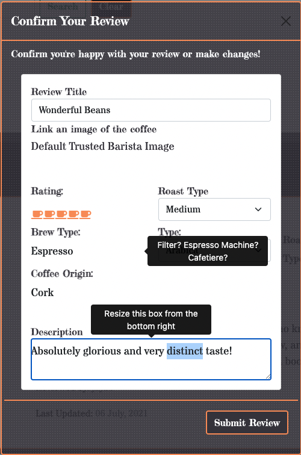
* When adding a review, the user can select font awesome icon's for their rating of 1-5. The icons are highlighted based on their selection and equally the highlight is removed if they change their mind. This is achieved by a styled checkbox and Javascript.   
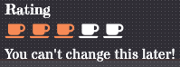
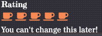
* When adding a review, a user has the option to check a box if they do not have an image link of the coffee they are reviewing, doing so displays a message, hides the input box and passes through a fallback image for form submission.  
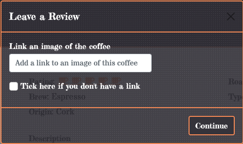
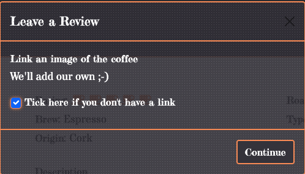
* When adding a review, an "affiliate" link is automatically generated and appended to the review to simulate an afiiliate partnership for commercialising the site. The link is generated using Javascript by taking the title of the coffee and creating a google search from it. The link opens in a new tab.  
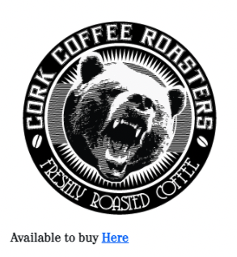

        purchase = preview[0].replace(/ /, "+")
        $("#affialiate_link").val("https://www.google.ie/search?q=" + purchase)

* The site has a 'Favourite' feature for it's users. A star icon is placed above each review and when hovered it is highlighted. When selected, the user can see from the reviews page favourited reviews by way of a full star and reviews not favourited by way of an empty star.  
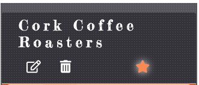

* The site features a pop up modal that prompts the user to subscribe to the newsletter. Doing so will send an email to the user thanking them for their subscription and if they are not signed in, direct them to create an account. This modal shows only once and uses local storage to check if it's been shown to them or not. When directed to the sign up page from the modal, the user's email address is pre populated to the sign-up form. As this works of count and creating a `localStorage` session, to test this feature more than once, navigate to chrome dev tools > application > localStorage and delete the session and usermail key:value pairs.   
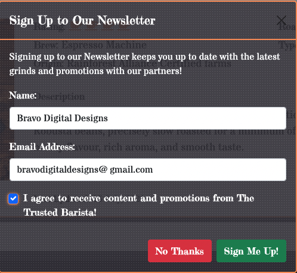
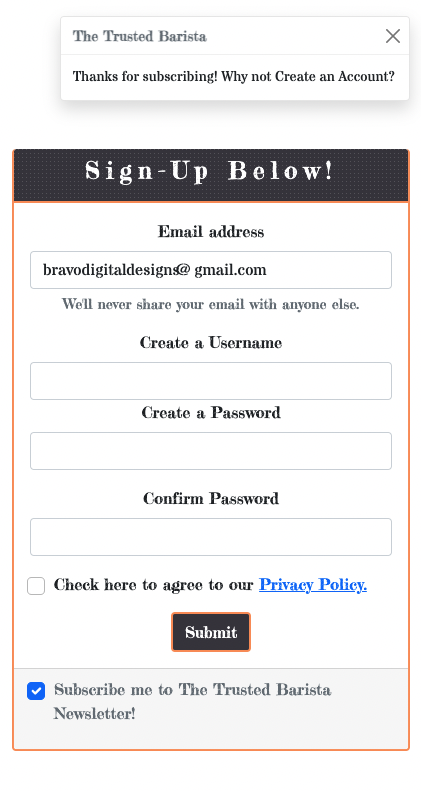
* The reviews page features a 'back to top' button after every third review to allow the user to jump back to the top of the page.  

* The reviews page features a Search bar allowing the user to search for reviews. Results are displayed and if no results are found the user is alerted.  
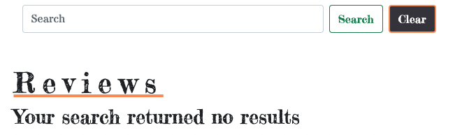
* The site features a footer with a sitemap dependant on a user logged in or not as well as privacy policy.  

* The site features a 'contact us' page with a contact form, a google map and contact information for the site owner. Completing the form will send an email to the user. The user is also notified of successfully submitting the form.  
 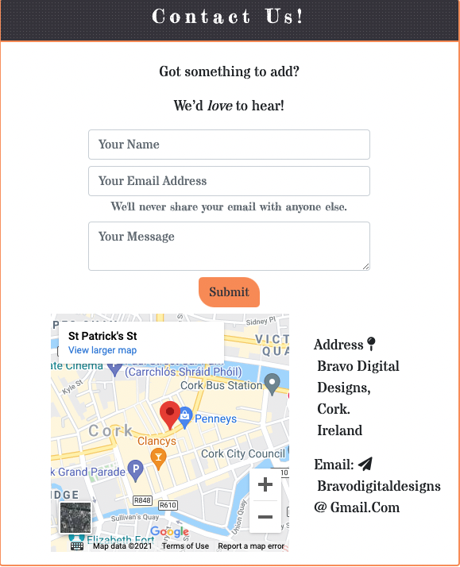
 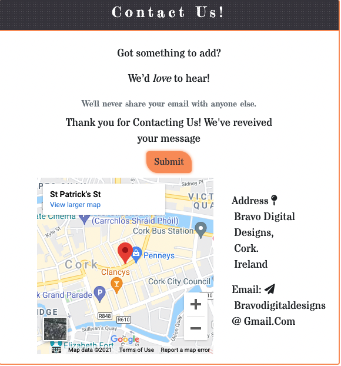
* The Site features a 404 page with a link to take them back to the home page should they navigate to a broken link.  
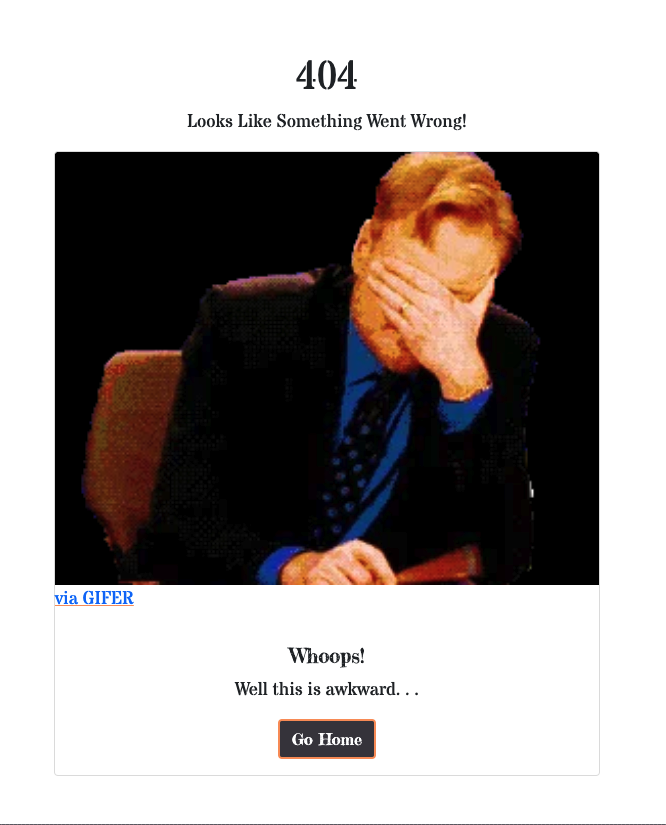

### User Features
#### User feature images can be found in the [TESTING.md Document](TESTING.md)
* Each review features it's own comment section. User's must be logged in to leave a comment. 
* User's can edit their own reviews or delete them. 
* User's can delete their own comments. 
* On a user's profile page, the reviews that a user has added are listed to them and linked directly to the reviews. 
* On a user's profile page, the reviews that have been favourited by the user are listed and linked directly to the reviews. 
* On a user's profile page, if the user has not left any reviews or added any favourites, they are prompted to do so. Following the add review link takes them to the reveiw page and the add review modal is displayed. 
* On a user's profile page, a user can update their subscription to the newsletter via a toggle. 
* On a user's profile page, a user can change their username and must confirm their change by authenticating their password.
* On a user's profile page, a user can update their password. 

### Admin Features
#### Admin feature images can be found in the [TESTING.md Document](TESTING.md) under 'Admin user Stories'
* Admins can see basic statistics of the site. 
* Admins can edit or delete reveiws.
* Admins can delete comments. 
* Admins can enable other users as Admins. They can disable them also.
* Admins can delete users. 
 
 ### Future features
 * Pagination. At present all reviews are listed on just one page which could get unwildly as the site grows. Pagination would be a highly desired feature.
 * The ability to upload and save files to the database. Student Care advised that it was best to utilise links for images throughout this project though adding this feature would allow for user to have their own profile image and not a default image that is currently used.
 * Sort and limit searching. To filter searches or limit searches by origin or roast type. This appears to be relatively straightforward to achieve though time did not allow for it's implementation. 
 * Google Maps APi to display the Origin of each coffee that is reviewed on the site.
 * Reset password link prior to sign in for users. 
 * Captcha authentiaction for sign up. Again appears to be straightforward to implement though time did not allow for it.   

## Technologies Used
### Languages Used
#### [HTML5](https://www.w3schools.com/html/default.asp)
* Html5 and semantic markup is used for the creation of this website.
#### [CSS3](https://www.w3schools.com/css/default.asp)
* CSS is used for styling various elements throughout the site. 
#### [Javascript/JQuery](https://www.w3schools.com/js/default.asp)
* JavaScript and Jquery language is used for development of some front features of the website and activation of Bootstrap features. 
#### [Python](https://www.w3schools.com/python/)
* Python 3 is used as the main application language.    

### Database
#### [MongoDB](https://cloud.mongodb.com/)
* MongoDB is used for storing and reading backend data.    

### Frameworks, Libraries & Programs Used
#### [Bootstrap v.5.0.0-beta-1](https://getbootstrap.com/) 
* Bootstrap was used throughout the project for it’s responsiveness of the website and styling such as paddings and margins. 
#### [Google Fonts](https://fonts.google.com/)  
* Google fonts were used for the importing of the ‘Fredericka the Great’ and ’ Stardos Stencil’ fonts to the style.css page which is used throughout the entirety of the site.
#### [Favicon]()  
* favIcon was used to create the site favicon.
#### [Figma](https://figma.com/)
* Figma was used to create wireframing.
#### [Coolors.co](https://coolors.co/)
* Coloors was used to assist with choosing the colour scheme that is used throughout the website.
#### [jQuery](https://www.w3schools.com/jquery/default.asp)
* jQuery was used extensively in the script files.
#### [Git](https://git-scm.com/)
* Git was used for version control by utilizing the Gitpod terminal to commit to Git and Push to GitHub.
#### [GitHub](https://github.com/)
* GitHub is used to store the projects code after being pushed from Git.
#### [Gitpod](https://gitpod.io/)
* Gitpod was used as the primary IDE for development of the site.  
#### [Flask](https://flask.palletsprojects.com/en/2.0.x/)
* Flask was used for it's Python web framework such as Jinja2 templating.    
#### [PyMongo](https://pypi.org/project/pymongo/)
* PyMongo is is a native Python driver for MongoDB allowing for interaction with MongoDB databases from Python.
#### [Werkzeug](https://werkzeug.palletsprojects.com/en/2.0.x/utils/)
* Werkzeug is one of the most advanced WSGI utility libraries. It was used primarily for debugging and security helpers.
#### [Randomkeygen](https://randomkeygen.com/)
* randomkeygen.com was used as a secure password and keygen generator for creation of the Flask SECRET_KEY.
#### [EmailJS](https://www.emailjs.com/)
* emailjs uses their own Javascript language to trigger the sending of emails using client-side technologies and was used for the automated responses to the signing up to the newsletter and contact us form. 
#### [Google Map Generator](https://google-map-generator.com/)
* Google Map generator was used to generate the iframe used for the embedded map found on the contact page and it's associated styling found in the css stylesheet. 
#### [Lighthouse](https://developers.google.com/web/tools/lighthouse)
* Lighthouse, a Google Web Dev tool, was used extensively for testing performance, accessability, best practices and SEO of the site in it's entirety.

## Testing
The W3C Markup Validator and W3C CSS Validator Services were used to validate every page of the project to ensure there were no syntax errors in the project. Whilst the W3C CSS validationr eturned no errors, W3C Markup did return numeros errors that appear to be largely related to not recognising the flask jinja templating. Every effort was made to rectify these issues though time did not permit the fixing of them. 

* [PEP8Online.com](http://pep8online.com/) was used for validating all Python code and passed validation. 

* All links have been extensively tested to ensure correct continuity.

### Testing User Stories from User Experience (UX)
Due to the extensiveness of testing User Stories. It's contens where moved to and can be found in [TESTING.MD file](TESTING.md)

#### Further Testing
Lighthouse, a Google Chrome web developement tool, was used extensively on the site in it's entirety. Every individual page was tested for desktop and mobile and received a score of average low to mid 90's across Performance, Accessability, Best Practices and SEO. The lowest score was 73 for Performance and the highest was 100 for best practices.   
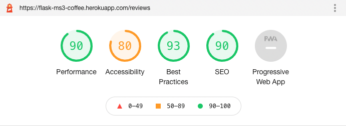    
A copy of the Lighthouse report for each individual page can be found below:    
* Index - [Lighthouse Desktop Result](mdassets/pdf/index-lighthouse-report-desktop.pdf) | [Lighthouse Mobile Result](mdassets/pdf/index-lighthouse-report-mobile.pdf)
* reviews - [Lighthouse Desktop Result](mdassets/pdf/reviews-lighthouse-report-desktop.pdf) | [Lighthouse Mobile Result](mdassets/pdf/reviews-lighthouse-report-mobile.pdf)
* signup - [Lighthouse Desktop Result](mdassets/pdf/signup-lighthouse-report-desktop.pdf) | [Lighthouse Mobile Result](mdassets/pdf/signup-lighthouse-report-mobile.pdf)
* contact - [Lighthouse Desktop Result](mdassets/pdf/contact-lighthouse-report-desktop.pdf) | [Lighthouse Mobile Result](mdassets/pdf/contact-lighthouse-report-mobile.pdf)
* privacy - [Lighthouse Desktop Result](mdassets/pdf/privacy-lighthouse-report-desktop.pdf) | [Lighthouse Mobile Result](mdassets/pdf/privacy-lighthouse-report-mobile.pdf)

#### Known Bugs
* During the devlopment cycle, a bug occured where adding a review to the users favourite would not disable or remove the favourite button for said favoured review. This appears to be related to the jinja for loop logic. This resulted in the possibility of a user adding the same review to their favourites repeatedly. To counter this, the following was implemented to the reviews.js: 

        /*Fixes bug where favourite button was still displaying on favourited reviews to user. 
        Identifies an element that contains 'remove-favourite' in id and selects the next element, in this case the favourite button.
        Adds bootstraps disabled and d-none class to hide and disable the button.  */

        $(document).ready(function () {
            $("a[id*='remove-favourite']").next().addClass("disabled d-none");
                //Changes class on FA icon on hover
            $('.fa-star, .fa-trash-alt, .fa-comments, .fa-edit').hover(
                function () {
                    $(this).toggleClass('far').toggleClass('fas')
                }
            )
        })

* During the development cycle, due to the number of modals that were being utilised to keep the user experience fluidic, a rogue closing `
` was found and removing the element caused a cascasding effect. To aid with the structure of the code, the larger modals were moved to the '/includes' folder and using jinja were included in their relevant `<form>` sections on the reviews page. This allowed the developer to recognise that it wasn't that the closing `
` was rogue but was rather closed at an earlier section too soon. Removing this earlier closing tag fixed the cascading effect that was otherwise found. 

* During the development cycle, a number of console errors were found that whilst nor related directly to the .js files of the devloper, but rather that of the jquery.min and bootstrap script files was causing console errors such as `$` not identified and a host of 'Illegal invocation' errors. These can be seen in the screenshot below. To counter this each .js file was wrapped in a `window.onload = function(){}`. In some pages, they had to be wrapped in `DOMContentReady`. 

    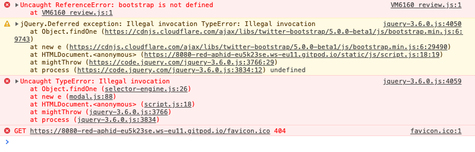

* An additional console error was found on the reviews page if a user was not logged in as the review.js file calls for a modal on this page to write a review. However, if a user is not logged in then the modal does not exist and so the console error was born. The following code was implemented on the profile.js (The landing page for a user when they log in or signup) and review.js files which set a sessionStorage on login and then defers the code initaing unless the sessionStorage exists. `sessionStorage.getItem(session)` The sessionStorage item is removed on logout to prevent the console error again.   

profile.js:

        let d = new Date();
        let uid = Math.floor(Math.random() * d.getTime());
        if (window.sessionStorage.length != 1){
         window.sessionStorage.setItem("session","user" + uid)
        }

review.js:    

        if ((window.sessionStorage.getItem("session") !== null) == true){
            ... }

* The clearButton.onclick does not clear the modal fields of Write-Review. Targeting the validate ID was causing validation issues and time did not permit further investigation. 
## Deployment

The website was created using Gitpod IDE. GitHub was used for hosting the repository and the environment is then deployed to Heroku for hosting. The following are the steps needed to set up your IDE, clone the repository and deploy to Heroku. In addition to those listed, MongoDB is used for storing the data and is also required for successful deployment. 

### 1. Clone the Repo
#### Local Clone
1. Navigate to the GitHub Repository: [Milestone Project 3 - The Trusted Barista ](https://github.com/LogisticBravo/Milestone-project-3)
2. Click the Code drop down menu.
3. Either Download the ZIP file, unpackage locally and open with IDE (This route ends here) OR Copy Git URL from the dialogue box.
4. Open your developement editor of choice and open a terminal window in a directory of your choice.
5. Use the 'git clone' command in terminal followed by the copied git URL.    

        git clone https://github.com/LogisticBravo/Milestone-project-3
6. A clone of the project will be created locally on your machine.

### 2. MongoDB Setup
1. If you don't have one already, create an account for MongoDB [here](https://www.mongodb.com/try).
2. Once signed in and within Atlas > Clusters > Collections : Create a Database.
3. Name the database "coffee_beans".
4. Within this database, create the followoing collections (case sensitive):    
    - beans
    - newsletters
    - origin
    - privacy_policy
    - roast
    - users

### 3. Environment Setup
1. Install requirements.txt via your IDE terminal window for dependencies and external libraies. *Important 

        pip3 install -r requirements.txt 

2. Create the `env.py` file and within it add the following:    

        import os 
        os.environ.setdefault("IP", "0.0.0.0")     
        os.environ.setdefault("PORT", "5000")     
        os.environ.setdefault("SECRET_KEY", "YOUR_SECRET_KEY")   
        os.environ.setdefault("MONGO_URI", "YOUR_MONGODB_URI")    
        os.environ.setdefault("MONGO_DBNAME", "YOUR_MONGODB_DATABASE_NAME")

    - Generate a secret key at [Randomkeygen.com](https://randomkeygen.com/) if you do not have one.    
3. Ensure that  "`env.py`" is added to your `gitignore` file. 
4. Ensure that your `Procfile` (case sensitive) is present. On the off chance that it is not:

        touch Procfile
    within it add the following:

        web: pyton app.py
5. Ensure that the above steps have been completed succesffully before proceeding to deployment. 
6. Stage, commit and push your local repo to GitHub.

        git add -A
        git commit -m "Initial Commit"
        git push

### 4. Deployment to Heroku
1. If you haven't already, Create an account and login to [Heroku](https://signup.heroku.com/).
2. Create a new app and give it a unique new name. Importance on unique as Heroku will flag if it's already taken. For simplicity, it's suggested to keep this aligned to your GitHub repository.
3. Choose from the available Shard options - EU or US - It's best to select closest to your location.
4. Navigate to App settings > 'Config Vars'
5. Replicate your previous variables from the `env.py` file here and ensure they match exactly.    

    |  Key | Value  |
    |:-:|:-:|
    |  IP |  0.0.0.0 |   
    |  PORT | 5000  |   
    |  SECRET_KEY |  YOUR_SECRET_KEY |   
    | MONGO_URI  |  YOUR_MONGODB_URI |   
    |  MONGO_DBNAME |  YOUR_MONGODB_DATABASE_NAME |   

6. From Heroku App deploy page:
    - Choose GitHub from the Deployment Method.
    - Hit "Connect to GitHub".
    - Log in to your GitHub from Heroku to link the App to GitHub.
    - Search for and select the repository to be linked in Github.
    - Hit Connect.
    - Choose Enable Automatic Deployment from the GitHub Master / Main branch.    
    
7. Open the App to confirm deployment. Note that Heroku can be slow to open on the first instance. 
  

### Development
We welcome all contributions. To do so:

1. Fork the Repo.
2. Log in to GitHub and locate the [Respository](https://github.com/LogisticBravo/Milestone-project-3).
3. At the top of the Repository (not top of page) just above the "Settings" Button on the menu, locate the "Fork" Button.
4. You should now have a copy of the original repository in your GitHub account.	
5. Create a new branch.
6. Make your changes and ensure adequate testing with supporting documents.
7. Adhere accordingly to the existing style. 
8. Commit often with clear commit messages.
9. Push to the branch.
10. Create a pull request.

### Bugs & Feature Requests

Should you find a bug and want to help us squash it. Please open an issue [here](https://github.com/LogisticBravo/Milestone-project-3/issues/new) ensuring you add the '**bug**' label  with clear detail under the following:
* What you done?
* Where you done it?
* What you expected to happen?
* What actually happened?
	
To request a new feature or function then please open an issue [here](https://github.com/LogisticBravo/Milestone-project-3/issues/new) ensuring you add the '**enhancement**' label  with proposed changes including snippets of how to do so.

## Credits

### Code
* Bootstrap 5.0.0-beta-1: Bootstrap Library used throughout the project mainly to make site responsive using the Bootstrap Grid System and classes for padding, margins etc.
* CSS Styling code and corresponding classes/id’s was largely that of the developer Jay Bradley. Additional code is commented within the stylesheet itself. Most notable of which is the code used for the `.cutout` class courtesy of [w3Schools](https://www.w3schools.com/howto/howto_css_cutout_text.asp) which was used to style the Trusted Barista logo in the navbar and footer. 
* With the exception of the following, all Javascript and JQuery code is that of the developer.
    *  The onscroll trigger for the `newsletter()` function in review.js was inspired by [w3schools](https://www.w3schools.com/jsref/tryit.asp?filename=tryjsref_onscroll3).
    * The local storage aspect of the `newsletter()` function in review.js was inspired by [Stackoverflow](https://stackoverflow.com/questions/8123032/how-do-i-make-a-count-variable-persistent-across-sessions).
    * The `.each(function())` within the `clearButton.onClick` in review.js was adapted from this [Codegrepper Post](https://www.codegrepper.com/code-examples/javascript/jquery+clear+all+input+fields).
    * Initializers from the Bootstrap library to inititiate the modals and tooltips.
* With exception of the authentication functionality to login using Werkzeug security helpers for salt & hash passwords and the basic structure of the CRUD functionality adapted from the Code Institute walkthrough projects of the Task manager, all other and additional Python code and logic is that of the developer Jay Bradley.
* Jinja2 templating is used for dynamic rendering. All jinja logic is that of the developer Jay Bradley. 
* [Python Tutor](http://pythontutor.com/) was used to troubleshoot logic when dealing with nested arrays on more than one occasion. 
* The hero image callout was adapted by the [starbootstrap theme business casual](https://startbootstrap.com/previews/business-casual).

### Content
* The structure and concept were entirely that of the the developer Jay Bradley. 
* All language and content is that of the developer Jay Bradley with the exception of reviews written by user 'Jay21' which were largely copied from the corresponding reviewed coffee's facebook. The developer cannot speak on behalf of reviews left by other users. 

### Media
* The Callout image was used from [freepik.es](https://www.freepik.es/fotos-premium/primer-plano-granos-cafe-especial-atencion_11280504.htm) and inverted.
* The navbar image was used from [shutterstock](https://www.shutterstock.com/image-photo/cup-coffee-beans-sack-on-dark-1037995396)
* The fallback image uses [Pixabay CDN](https://pixabay.com/photos/coffee-coffee-beans-cup-coffee-cup-171653/)
* The user profile image was used from [freesvg](https://freesvg.org/users-profile-icon)
* the 404 page uses a gif from [Gifer](https://gifer.com/en/2ii7)

### Acknowledgements
* My wife for her continued and tireless support as I worked through this project.
* My Mentor, Seun for her great feedback and continously pushing me.
* Fellow student [AideenM12](https://github.com/AideenM12) for her amazing feedback and encouragement and for giving me some useful ideas and direction with my README testing.
* Fellow student and now a CI Mentor [Daisy McGirr](https://github.com/Daisy-McG) for helping to troubleshoot some of my console errors and given me the motivation to fixing them.
* My work Colleague and fellow developer John O' Donoghue for breaking the site when I asked him too and giving some great feedback.
* [CSS Tricks](https://css-tricks.com/) for being a great place for inspiration and knowledge.
* [W3 Schools](https://www.w3schools.com/) for the wealth of information thats available.
* [Flask documentation](https://jinja.palletsprojects.com/en/3.0.x/) for all things related with troubleshooting. 
* [MongoDB 5.0 Manual](https://docs.mongodb.com/manual/) for being a pillar stone of information for dealing with numerous queries to the database.
* [Stack Overflow](https://stackoverflow.com/) for always having something that would put you on the right track. 
* [Pythontutor](http://pythontutor.com/) for an unbelievable visual of code execution allowing me to troublshoot querying dictionarys in arrays in arrays in disctionaries. 
* [Code Institute](https://codeinstitute.net/) fro amazing couursework. The core CRUD from the Task Manager walkthrough project. The intorduction from the Thorin flask project. For challenging me beyond my limits and opening my up my inspiration. 